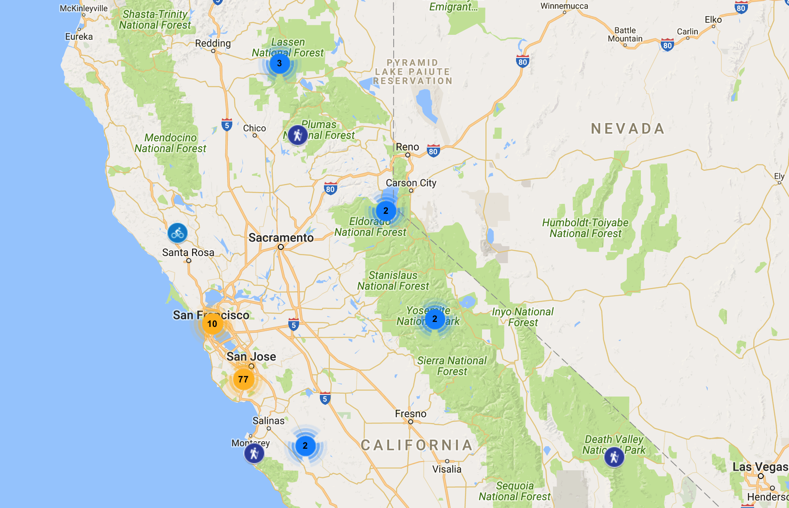
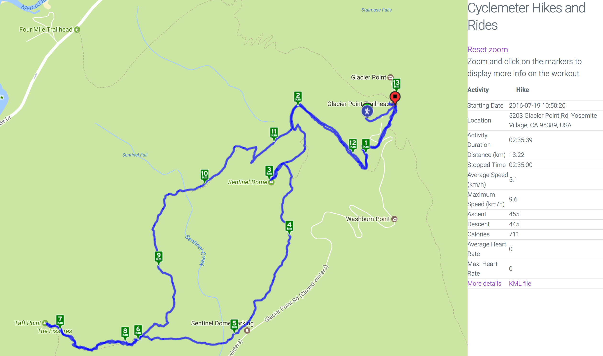

# Cyclemeter Runs Map

This is a simple map, using Google Maps JS API to display on a single Google map all your runs from your CycleMeter database. 

## How does this work

[CycleMeter](http://abvio.com/cyclemeter/) is an IOS application to record your rides, hikes and other physical activities on your phone. It records your position, speed, altitude, heart rate, etc. and stores them in an sqlite3 database on your phone, optionally synchronized across devices with iCloud.
Cyclemeter allows you to share your run data from their web site. Once a run is completed, it can upload the data on cyclemeter.com and show it in web page and a KML file. However, it does not provide a way to map all your rides on a single map. Hence this little project.

This web application extracts the data from the sqlite3 database and builds a map to display every run stored in the database.It displays them as "clustered" markers on Google Maps. A click on specific markers shows the run's track as a KML layer on the map. 

The CycleMeter DB file (Meter.db) needs to be uploaded from the iPhone to the web site where the web application runs. See the FAQ on [Cyclemeter Support site](http://abvio.com/question/transfer/) to see how to use iTunes file sharing to retrieve the file.

 
 ## Dependencies
 
 1. A web server to host the static pages, the CGI script (perl), and the CycleMeter sqlite3 db.
 1. You will need a [Google Maps JS API key](https://developers.google.com/maps/documentation/javascript/get-api-key#key-restrictions)
 1. Perl dependencies on the server: CGI, JSON::XS, DateTime, DBI, DBD::SQLite
 
 ## How to use it:
 1. Drop the files in a web accessible directory
 1. Upload the CycleMeter Meter.db file to your server: It should be in a non web-accessible directory on the server.
 1. Edit index.html to set your Google API key (look for 'key=' near the bottome of the file)
 1. Edit runs.json.cgi to set the path to the CycleMeter Meter.db file 
 1. Configure your web server to execute .cgi files as CGI: ex. Apache
     `AddHandler cgi-script .cgi`
     
 ## Screenshots
 
 

 

 
